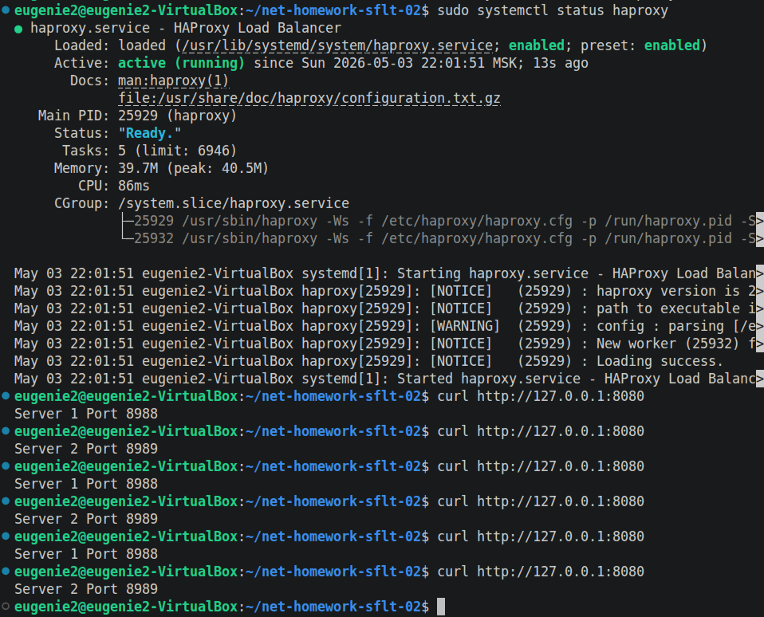
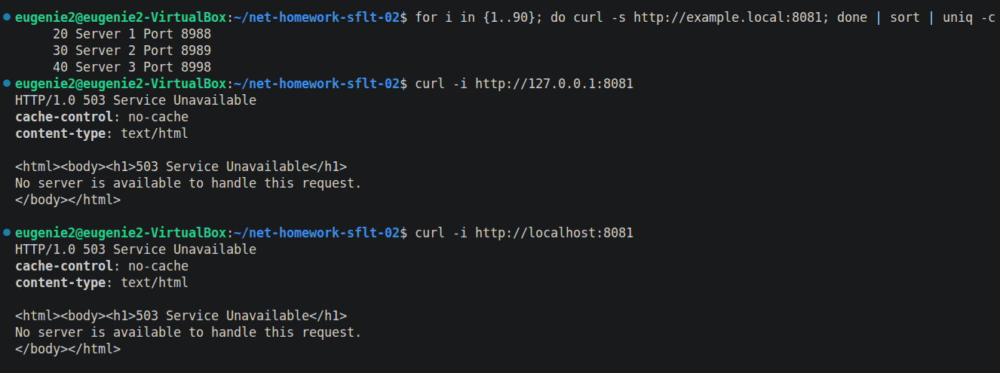

# Домашнее задание к занятию "Кластеризация и балансировка нагрузки" - Котуков Евгений


### Инструкция по выполнению домашнего задания

   1. Сделайте `fork` данного репозитория к себе в Github и переименуйте его по названию или номеру занятия, например, https://github.com/имя-вашего-репозитория/git-hw или  https://github.com/имя-вашего-репозитория/7-1-ansible-hw).
   2. Выполните клонирование данного репозитория к себе на ПК с помощью команды `git clone`.
   3. Выполните домашнее задание и заполните у себя локально этот файл README.md:
      - впишите вверху название занятия и вашу фамилию и имя
      - в каждом задании добавьте решение в требуемом виде (текст/код/скриншоты/ссылка)
      - для корректного добавления скриншотов воспользуйтесь [инструкцией "Как вставить скриншот в шаблон с решением](https://github.com/netology-code/sys-pattern-homework/blob/main/screen-instruction.md)
      - при оформлении используйте возможности языка разметки md (коротко об этом можно посмотреть в [инструкции  по MarkDown](https://github.com/netology-code/sys-pattern-homework/blob/main/md-instruction.md))
   4. После завершения работы над домашним заданием сделайте коммит (`git commit -m "comment"`) и отправьте его на Github (`git push origin`);
   5. Для проверки домашнего задания преподавателем в личном кабинете прикрепите и отправьте ссылку на решение в виде md-файла в вашем Github.
   6. Любые вопросы по выполнению заданий спрашивайте в чате учебной группы и/или в разделе “Вопросы по заданию” в личном кабинете.

---

### Задание 1
- Запустите два simple python сервера на своей виртуальной машине на разных портах
- Установите и настройте HAProxy, воспользуйтесь материалами к лекции по [ссылке](https://github.com/netology-code/sflt-homeworks/tree/main/2)
- Настройте балансировку Round-robin на 4 уровне.
- На проверку направьте конфигурационный файл haproxy, скриншоты, где видно перенаправление запросов на разные серверы при обращении к HAProxy.

### Решение:



```
eugenie2@eugenie2-VirtualBox:~/net-homework-sflt-02$ cat /etc/haproxy/haproxy.cfg
global
        log /dev/log    local0
        log /dev/log    local1 notice
        chroot /var/lib/haproxy
        stats socket /run/haproxy/admin.sock mode 660 level admin
        stats timeout 30s
        user haproxy
        group haproxy
        daemon

        # Default SSL material locations
        ca-base /etc/ssl/certs
        crt-base /etc/ssl/private

        # See: https://ssl-config.mozilla.org/#server=haproxy&server-version=2.0.3&config=intermediate
        ssl-default-bind-ciphers ECDHE-ECDSA-AES128-GCM-SHA256:ECDHE-RSA-AES128-GCM-SHA256:ECDHE-ECDSA-AES256-GCM-SHA384:ECDHE-RSA-AES256-GCM-SHA384:ECDHE-ECDSA-CHACHA20-POLY1305:ECDHE-RSA-CHACHA20-POLY1305:DHE-RSA-AES128-GCM-SHA256:DHE-RSA-AES256-GCM-SHA384
        ssl-default-bind-ciphersuites TLS_AES_128_GCM_SHA256:TLS_AES_256_GCM_SHA384:TLS_CHACHA20_POLY1305_SHA256
        ssl-default-bind-options ssl-min-ver TLSv1.2 no-tls-tickets

defaults
        log     global
        mode    http
        option  httplog
        option  dontlognull
        timeout connect 5000
        timeout client  50000
        timeout server  50000
        errorfile 400 /etc/haproxy/errors/400.http
        errorfile 403 /etc/haproxy/errors/403.http
        errorfile 408 /etc/haproxy/errors/408.http
        errorfile 500 /etc/haproxy/errors/500.http
        errorfile 502 /etc/haproxy/errors/502.http
        errorfile 503 /etc/haproxy/errors/503.http
        errorfile 504 /etc/haproxy/errors/504.http

frontend eugen_tcp_frontend
        bind *:8080
        mode tcp
        default_backend eugen_tcp_backend

backend eugen_tcp_backend
        mode tcp
        balance roundrobin
        server python1 127.0.0.1:8988 check
        server python2 127.0.0.1:8989 check
```


### Задание 2
- Запустите три simple python сервера на своей виртуальной машине на разных портах
- Настройте балансировку Weighted Round Robin на 7 уровне, чтобы первый сервер имел вес 2, второй - 3, а третий - 4
- HAproxy должен балансировать только тот http-трафик, который адресован домену example.local
- На проверку направьте конфигурационный файл haproxy, скриншоты, где видно перенаправление запросов на разные серверы при обращении к HAProxy c использованием домена example.local и без него.

### Решение:

Для начала добавил запись example.local в /etc/hosts

Результат настроки haproxy, для наглядности прогнал 10 циклов (один цикл по весам 2+3+4=9) и убедился, что не получится достучаться без доменного имени:



```
eugenie2@eugenie2-VirtualBox:~/net-homework-sflt-02$ cat /etc/haproxy/haproxy.cfg
global
        log /dev/log    local0
        log /dev/log    local1 notice
        chroot /var/lib/haproxy
        stats socket /run/haproxy/admin.sock mode 660 level admin
        stats timeout 30s
        user haproxy
        group haproxy
        daemon

        # Default SSL material locations
        ca-base /etc/ssl/certs
        crt-base /etc/ssl/private

        # See: https://ssl-config.mozilla.org/#server=haproxy&server-version=2.0.3&config=intermediate
        ssl-default-bind-ciphers ECDHE-ECDSA-AES128-GCM-SHA256:ECDHE-RSA-AES128-GCM-SHA256:ECDHE-ECDSA-AES256-GCM-SHA384:ECDHE-RSA-AES256-GCM-SHA384:ECDHE-ECDSA-CHACHA20-POLY1305:ECDHE-RSA-CHACHA20-POLY1305:DHE-RSA-AES128-GCM-SHA256:DHE-RSA-AES256-GCM-SHA384
        ssl-default-bind-ciphersuites TLS_AES_128_GCM_SHA256:TLS_AES_256_GCM_SHA384:TLS_CHACHA20_POLY1305_SHA256
        ssl-default-bind-options ssl-min-ver TLSv1.2 no-tls-tickets

defaults
        log     global
        mode    http
        option  httplog
        option  dontlognull
        timeout connect 5000
        timeout client  50000
        timeout server  50000
        errorfile 400 /etc/haproxy/errors/400.http
        errorfile 403 /etc/haproxy/errors/403.http
        errorfile 408 /etc/haproxy/errors/408.http
        errorfile 500 /etc/haproxy/errors/500.http
        errorfile 502 /etc/haproxy/errors/502.http
        errorfile 503 /etc/haproxy/errors/503.http
        errorfile 504 /etc/haproxy/errors/504.http

frontend eugen_tcp_frontend
        bind *:8080
        mode tcp
        default_backend eugen_tcp_backend

backend eugen_tcp_backend
        mode tcp
        balance roundrobin
        server python1 127.0.0.1:8988 check
        server python2 127.0.0.1:8989 check

frontend eugen_http_frontend
        bind *:8081
        mode http

        acl host_example hdr_beg(host) -i example.local
        use_backend eugen_http_backend if host_example

backend eugen_http_backend
        mode http
        balance roundrobin

        server python1 127.0.0.1:8988 check weight 2
        server python2 127.0.0.1:8989 check weight 3
        server python3 127.0.0.1:8998 check weight 4
```
---

## Задания со звёздочкой*
Эти задания дополнительные. Их можно не выполнять. На зачёт это не повлияет. Вы можете их выполнить, если хотите глубже разобраться в материале.

---

### Задание 3*
- Настройте связку HAProxy + Nginx как было показано на лекции.
- Настройте Nginx так, чтобы файлы .jpg выдавались самим Nginx (предварительно разместите несколько тестовых картинок в директории /var/www/), а остальные запросы переадресовывались на HAProxy, который в свою очередь переадресовывал их на два Simple Python server.
- На проверку направьте конфигурационные файлы nginx, HAProxy, скриншоты с запросами jpg картинок и других файлов на Simple Python Server, демонстрирующие корректную настройку.

---

### Задание 4*
- Запустите 4 simple python сервера на разных портах.
- Первые два сервера будут выдавать страницу index.html вашего сайта example1.local (в файле index.html напишите example1.local)
- Вторые два сервера будут выдавать страницу index.html вашего сайта example2.local (в файле index.html напишите example2.local)
- Настройте два бэкенда HAProxy
- Настройте фронтенд HAProxy так, чтобы в зависимости от запрашиваемого сайта example1.local или example2.local запросы перенаправлялись на разные бэкенды HAProxy
- На проверку направьте конфигурационный файл HAProxy, скриншоты, демонстрирующие запросы к разным фронтендам и ответам от разных бэкендов.


------

### Правила приема работы

1. Необходимо следовать инструкции по выполнению домашнего задания, используя для оформления репозиторий Github
2. В ответе необходимо прикладывать требуемые материалы - скриншоты, конфигурационные файлы, скрипты. Необходимые материалы для получения зачета указаны в каждом задании.


------

### Критерии оценки

- Зачет - выполнены все задания, ответы даны в развернутой форме, приложены требуемые скриншоты, конфигурационные файлы, скрипты. В выполненных заданиях нет противоречий и нарушения логики
- На доработку - задание выполнено частично или не выполнено, в логике выполнения заданий есть противоречия, существенные недостатки, приложены не все требуемые материалы.